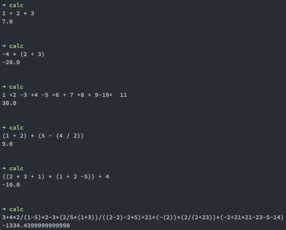
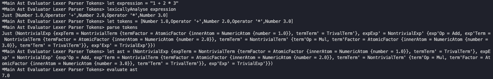
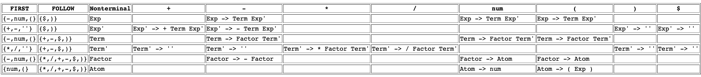
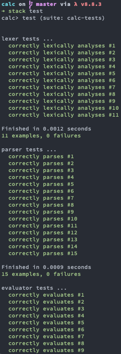

# calc

### Introduction
**calc** is a simple console calculator written in Haskell. So far it covers following expression types:

- Basic arithmetic +, -, *, / 
  - Example : 1 + 2 * 3
- Parenthesised expressions:
  - Example : (1 + 2) * 3 - ((2 - 1)/(4 + 2))
- Unary minus:
  - Example : -(-(2+3))

Expressions can have arbitrary number of whitespaces between characters and will be computed correctly provided they are lexically and semantically valid. 
 
Here is a complete supported grammar in Backus–Naur form:

``` BNF
Exp   -> Term Exp'
Exp'  -> + Term Exp'
      |  - Term Exp'
      | ε
Term  -> Factor Term'
Term' -> * Factor Term'
      |  / Factor Term'
      | ε
Factor -> - Factor
      | Atom
Atom -> Number
      | ( Exp )
```
      
The implementation consists of :
- Encoding arithmetic expressions as a stream of tokens [(see Tokens.hs)](https://github.com/gboduljak/calc/blob/master/src/Tokens.hs)
- Encoding arithmetic expressions as an abstract syntax tree [(see Ast.hs)](https://github.com/gboduljak/calc/blob/master/src/Ast.hs)
- Lexical analysis (see Lexer.hs)
- Parsing a stream of tokens (see Parser.hs)
- Evaluation of a valid abstract syntax tree (see Evaluator.hs)

Unit tests are written using Hspec and cover:
 - Lexical analysis (see LexerSpec.hs)
 - Parsing (see ParserSpec.hs)
 - Evaluation (see EvaluatorSpec.hs)
 
### A few examples



### A short algorithm description
In order to perform expression evaluation, **calc** performs these steps in order:
  1) lexically analyses the input string
      - checks whether every character is a valid character and builds a stream of tokens
  2) parses the stream of tokens produced by the previous step
      - builds the expression syntax tree taking account for operator precedence, nested expressions ...
  3) evaluates the expression tree produced from the previous step

You can see how it is put together here:



### Implementation
#### Lexical analysis
The algorithm used for the lexical analysis is a handcoded implementation of a DFA with following states:

``` Haskell
data LexerState = Start     | 
                  Digits    |
                  DigitsDot |
                  Operators |
                  Parens    |
                  Error
                  deriving (Show)
```
You can see the implementation [here](https://github.com/gboduljak/calc/blob/master/src/Lexer.hs).
#### Parsing
The expression tree which we are going to use is a direct implementation of above described grammar and is implemented using algebraic data types:

``` Haskell
data Exp    = NontrivialExp { expTerm :: Term, expExp' :: Exp' }
            | TrivialExp
            deriving (Show, Eq)
data Exp'   = NontrivialExp' { exp'Op :: ArithOp, exp'Term :: Term, exp'Exp' :: Exp'}
            | TrivialExp'
            deriving (Show, Eq)
data Term   = NontrivialTerm { termFactor :: Factor, termTerm' :: Term' } deriving (Show, Eq)
data Term'  = NontrivialTerm' { term'Op :: ArithOp, term'Factor :: Factor, term'Term' :: Term' }
            | TrivalTerm'
            deriving (Show, Eq)
data Factor = NegativeFactor { innerFactor :: Factor }
            | AtomicFactor { innerAtom :: Atom }
            deriving (Show, Eq)
data Atom   = NumericAtom { number :: Double }
            | ExpAtom { innerExp :: Exp }
            deriving (Show, Eq)

data ArithOp = Add | Sub | Mul | Div deriving (Show, Eq)
```

The parsing algorithm is a form of backtrack-free, lookahead (1) recursive descent.
The algorithm relies on the fact that the following grammar used:
``` BNF
Exp   -> Term Exp'
Exp'  -> + Term Exp'
      |  - Term Exp'
      | ε
Term  -> Factor Term'
Term' -> * Factor Term'
      |  / Factor Term'
      | ε
Factor -> - Factor
      | Atom
Atom -> Number
      | ( Exp )
```
is LL(1) and hence can be parsed using the following LL(1) table:



As a consequence, we can parse it using mutually recursive expressions such as :

``` Haskell
parseExp :: [Token] -> (Maybe Exp, [Token])
parseExp [] = (Just TrivialExp,[])
parseExp tokens@(lookahead : rest)
  | (Operator op)       <- lookahead  = parse' op
  | (Tokens.Number num) <- lookahead  = parse' 'n'
  | OpenParens          <- lookahead  = parse' '('
  | otherwise                         = (Nothing, tokens)
  where parse' look | look == '+' = (liftIntoExp term exp', resultRest)
                    | look == '-' = (liftIntoExp term exp', resultRest)
                    | look == '(' = (liftIntoExp term exp', resultRest)
                    | look == 'n' = (liftIntoExp term exp', resultRest)
                    | otherwise   = (Nothing, tokens)
                    where (term, termRest)   = parseTerm tokens
                          (exp', resultRest) = parseExp' termRest
```
You can see the full implementation [here](https://github.com/gboduljak/calc/blob/master/src/Parser.hs).

#### Evaluation
Evaluation is performed using a simple inorder tree walk which is implemented as a set of mutually recursive expressions which destruct abstract syntax tree.
An example of such expression is here:

``` Haskell
evaluateExp' :: Exp' -> Double
evaluateExp' TrivialExp' = 0
evaluateExp' NontrivialExp' { 
  exp'Op = op, 
  exp'Term = term, 
  exp'Exp' = rest 
} 
  | op == Add = evaluateTerm term + evaluateExp' rest
  | op == Sub = - evaluateTerm term + evaluateExp' rest
```
You can see the full implementation [here](https://github.com/gboduljak/calc/blob/master/src/Evaluator.hs).

### Setup & Dependencies

In order to build **calc** from the source, you will need a [Haskell stack](https://docs.haskellstack.org/en/stable/README/).

 
#### Build
  1. Clone the project
  2. Run **stack build** in the root of the repository
      - This should automatically pull dependencies, compile and build calc executable
  3. Execute using **stack exec calc** in the root of the repository

#### Run in interactive mode
  1. Run **stack ghci** in the app folder of the repository
  
#### Test
  1. Run **stack test** in the root of the repository
  
You should get something like this:




#### Install
If you want to use it in your console without running **stack exec calc** every time, it is possible to install it using **stack install** command in the root of the repository. 
After that, **calc** should be available for a direct use such as: calc 1 + 2

### Possible improvements
- Support power operator
- Support various functions like abs, floor, ceil ...
- Support trigonometric functions
- PrettyPrint the resulting abstract syntax tree
 
